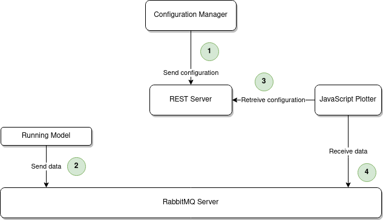

# Liviz

Framework for plotting during a debugging session. Written in VanillaJS

## Require
 
* RabbitMQ 3.8.19 (Docker setup recommended)
* StompJs 6.1.0
* D3Js v4
* Bootstrap 5.0.1

## Incremental Plotter

This framework allows to display 2D curves in GNU Plot format (https://people.duke.edu/~hpgavin/gnuplot.html) incrementally, using the d3js library. The communication of the curve is done via a websocket chatting with a RabbitMQ server. 

In this context, it is used to follow the evolution of the value of variables resulting from the interpretation of a nablab program. The interpreter communicates the values which will be plotted in real time by the framework. 

 
## Content

This repository contains: 

* **Scripts** : Contains linux scripts (sudo required) allowing to launch rabbitmq and the plugins necessary for the proper functioning of StompJs
* **Visualizer** : The sources of the plotter written in pure javascript 
* **Rest** : A rest API written in python allowing to fetch configurable plots 
* **Example Files** : Examples of GnuPlot files that can be displayed using the javascript viewer. 

## How to use

> Installation guide required
> Release & Dockerization required
