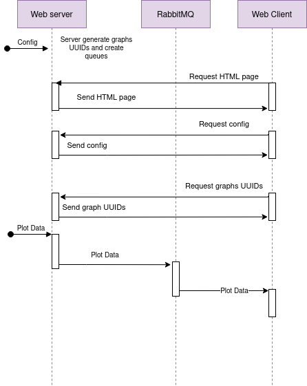
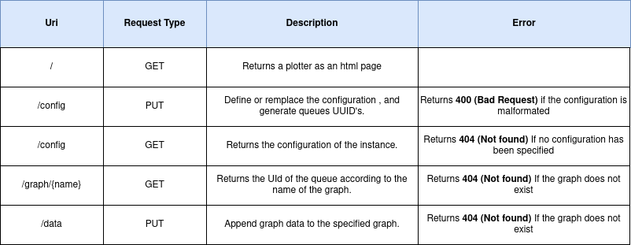

# Liviz

Framework for plotting during a debugging session. The plotter is written in VanillaJS and is provided by a Rest API using NodeJs and ExpressJS.

## Dependencies
 
* RabbitMQ 3.8.19 (Docker setup recommended)
* StompJs 6.1.0 (Included)
* AMQP ```npm install amqplib```
* D3Js v4
* Bootstrap 5.0.1 (included)
* node 14.17.1
* npm 6.14.13
* express js ```npm install express --save```
* body-parser ```npm i body-parser```
* uuid ```npm i uuid```

## Incremental Plotter


This framework allows to display 2D curves in GNU Plot format (https://people.duke.edu/~hpgavin/gnuplot.html) incrementally, using the d3js library. The communication of the curve is done via a websocket chatting with a RabbitMQ server. 

In this context, it is used to follow the evolution of the value of variables resulting from the interpretation of a nablab program. The interpreter communicates the values which will be plotted in real time by the framework. 






 
## Content

This repository contains: 

* **Scripts** : Contains linux scripts (sudo required) allowing to launch rabbitmq and the plugins necessary for the proper functioning of StompJs
* **Source** : The sources of the rest API
* **Source/html** : The sources of the plotter
* **Misc** : Some random files related to the project (images, rawdata etc)

## How to use

1. Install all the dependencies
2. Run all scripts in the **Scripts** folder (sudo).
3. Launch the Rest API using this command : 

```
node Sources/app.js.
```


> Release & Dockerization required
