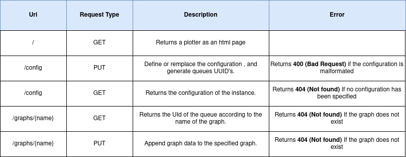

# Liviz

Liviz Framework for plotting during a debugging session. The plotter is written in VanillaJS and is provided by a Rest API using NodeJs and ExpressJS.


* This framework allows to display 2D curves in GNU Plot format (https://people.duke.edu/~hpgavin/gnuplot.html) incrementally, using the d3js library. The communication of the curve is done via a websocket chatting with a RabbitMQ server. 

* The data exchanged between the model and the plotter goes through a Rest API accessible in ```Sources/``` written in NodeJs. It is possible to send a plot configuration, and append data to the graphs. Below is a sequence diagram showing the correct order of requests to send to the API. You can find exemples of api calls in ```Scripts/API/```



* For now, this plotter is used to follow the evolution of the value of variables resulting from the interpretation of a nablab program. The interpreter communicates the values which will be plotted in real time by the framework. 

 
## Content

This repository contains: 

* **Scripts** : Contains linux scripts (sudo required) allowing to launch rabbitmq and the plugins necessary for the proper functioning of StompJs
* **Sources** : The sources of the rest API
* **Sources/html** : The sources of the plotter
* **Misc** : Some random files related to the project (images, rawdata etc)

## Dependencies
 
 | Name        | Version           | Install  |
| ------------- |:-------------:| -----:|
| RabbitMQ (Docker setup recommanded)      | 3.8.19 | https://www.rabbitmq.com/download.html |
| node | 14.17.1 | https://nodejs.org/en/download/ |
| Npm | 6.14.13 | Installed with nodejs |
| AMQP | *     |   ```npm install amqplib``` |
| ExpressJs | * | ```npm install express --save``` |
| body-parser | * | ```npm i body-parser``` |
| uuid | * | ```npm i uuid``` |
| StompJs      | 6.1.0      |   Included |
| D3Js | 4.0 | Included |
| Bootstrap | 5.0.1 | Included |

## Exemple of usage

1. Install all the dependencies
2. Run all scripts in the ```Scripts/``` folder (sudo).
3. Launch the Rest API using this command :  ```node Sources/app.js.```
4. Run ```Scripts/API/conf.sh```
5. Run ```Script/API/data.sh ```
6. The plotter result is accessible at  http://localhost:3000/

> Release & Dockerization required
